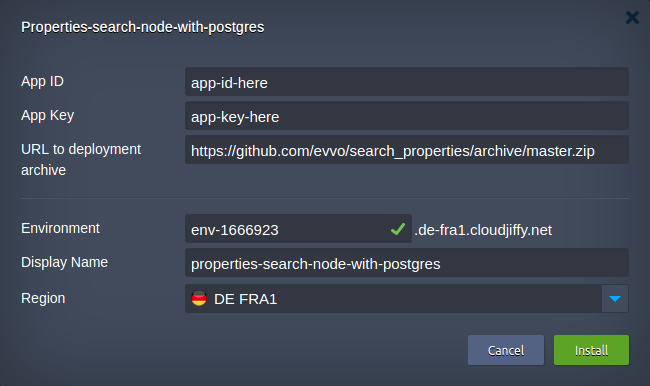

# Properties search app

### Properties Search Deployment to the Cloud


Click the **DEPLOY TO JELASTIC** button, specify your email address within the widget and press **Install**.

[](https://jelastic.com/install-application/?manifest=https://raw.githubusercontent.com/evvo/search_properties/master/infrastructure/manifest.yaml)

> **Note:** If you are already registered at Jelastic, you can deploy this cluster by importing the  [package manifest raw link](https://raw.githubusercontent.com/evvo/search_properties/master/infrastructure/manifest.yaml) within the [dashboard](https://docs.jelastic.com/dashboard-guide).

You will be prompted for APP ID and APP KEY credentials for Here.com API as well as
an option to choose a different URL for initial package deployment.

Environment name will be the name of your environment. It will also be the initial
url generated for your application.

Usually, you can choose between multiple regions, depending on your hosting provider.

and click on __Install__




### Install locally for development

- Install nodejs 12.x (tested with 12.18.2)

- Install PostgreSQL or PostgreSQL-compatible database (like CockroachDB)

- Install all of the dependencies:
```bash
npm ci
```

- Copy the example environment file:
```bash
cp .env.example .env
```

- Adjust the settings in the `.env` file:

Datbase settings
```bash
DB_HOST=127.0.0.1
DB_USER=maxroach
DB_PASSWORD=
DB_NAME=search_properties
DB_PORT=26257
DB_VERSION=12
# Used for databases like CockroachDB
DB_MIGRATIONS_TRANSACTIONS=false
DEBUG=knex:*
```
`DEBUG` is the debug parameter used in knex for adjusting the debug information

`DB_MIGRATIONS_TRANSACTIONS` is an additional environment variable, related to a problem
when running migrations under databases like CockroachDB. Set to `false` for CockroachDB

- Run the migrations:
```bash
npm run migrate
```

- Start the server (this will start the server behind `nodemon`, so that your changes to files will cause server restart)
```bash
npm run dev
```

SWAGGER API Docs are available at this endpoint:

`/api-docs/`